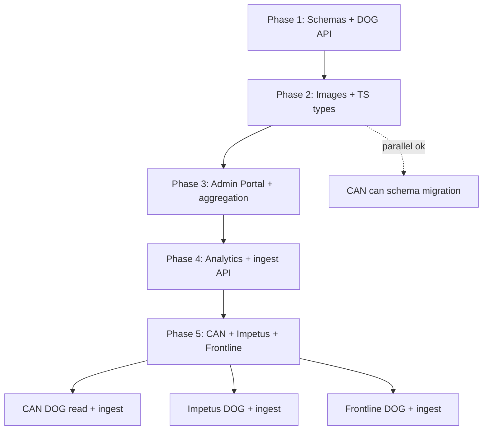

# DOGS Development Plans — Index

Overview of all implementation phases. Each phase has a dedicated dev plan with milestones, tasks, and success criteria.

**Architecture reference:** [DOGS_Architecture_Specification.md](./DOGS_Architecture_Specification.md)

---

## Phase summary

| Phase | Focus | Apps coupled? | Sheet role |
|-------|-------|---------------|------------|
| **1** | Shared schemas + canonical DOG API | No | Editor (sync → DOGS) |
| **2** | GCS images, TS types, local schema adoption | No | Still editor |
| **3** | Admin Portal, aggregation jobs, cleanup/trash DB | Optional read | Deprecated |
| **4** | Analytics, reporting, ingest API | Pilot only | Archived |
| **5** | Wire CAN, Impetus, Frontline to DOGS API | **Yes** | Archived |

---

## Phase 1 — Foundation

**[DOGS_Phase1_Dev_Plan.md](./DOGS_Phase1_Dev_Plan.md)**

- `dogs-schemas` Python package (DirectoryEntry, Category, Cleanup, TrashReport)
- DOGS FastAPI on Cloud Run, `dogs` schema on Cloud SQL
- Google Sheet sync (columns A–P), geocoding, image URL sanitization
- CRUD `/directory`, manual `POST /admin/sync-from-sheet`
- ~72 DOG entries, stable UUIDs

**Exit criteria:** API deployed, sheet sync works, schemas package installable.

---

## Phase 2 — Quality & distribution

**[DOGS_Phase2_Dev_Plan.md](./DOGS_Phase2_Dev_Plan.md)**

- GCS image pipeline (replace broken/base64 URLs)
- API auth on write/admin routes
- TypeScript types from OpenAPI
- Apps adopt `dogs-schemas` locally (no DOGS API calls)
- CAN migration to `can` schema
- Refine Cleanup / TrashReport schemas against real app data

**Exit criteria:** Stable image URLs, TS types in at least one app, admin endpoints secured.

---

## Phase 3 — Admin & aggregation

**[DOGS_Phase3_Dev_Plan.md](./DOGS_Phase3_Dev_Plan.md)**

- Admin Portal for DOG CRUD (replaces Sheet)
- GCS image upload in UI
- Kumu export endpoint
- DB tables: `cleanups`, `trash_reports`
- Scheduled pull from CAN + Frontline into DOGS
- Optional: CAN stops local sheet sync, reads DOGS instead

**Exit criteria:** Sheet unused, Admin Portal is editor, aggregation job populates cleanup/trash tables.

---

## Phase 4 — Ecosystem visibility

**[DOGS_Phase4_Dev_Plan.md](./DOGS_Phase4_Dev_Plan.md)**

- Stats and map APIs (GeoJSON, CSV)
- Optional analytics dashboard
- Apps read DOG / aggregated maps from DOGS (cached)
- Optional: app write path (local DB + async DOGS ingest)
- Optional: identity resolution for duplicate orgs
- Optional: per-app visibility rules

**Exit criteria:** Cross-app reporting works, ingest API ready, DOGS hardened for app traffic.

---

## Phase 5 — Downstream app integration

**[DOGS_Phase5_Dev_Plan.md](./DOGS_Phase5_Dev_Plan.md)**

- Shared Python/TS `DogsClient` SDK
- **CAN:** DOG reads from DOGS, remove sheet sync, ingest cleanups/trash from `actions`
- **Impetus:** DOG browse page, Cloud Function proxy + event ingest for trash-cleanup
- **Frontline:** DOG directory, ingest `contributions` + `problem_reports`
- Feature flags, async ingest, graceful degradation
- Deprecate duplicate local DOG/sync code

**Exit criteria:** All three apps read DOG from DOGS and publish shared cleanup/trash data; Sheet fully retired.

---

## Dependency graph



---

## Cross-cutting concerns

| Concern | Phase introduced | Notes |
|---------|------------------|-------|
| Postgres `dogs` schema | 1 | All DOGS tables |
| Geocoding | 1 | Google Maps API |
| Google Sheet sync | 1 | Deprecated in 3 |
| GCS images | 2 | Stable asset URLs |
| API authentication | 2 | API key; Firebase in 3 |
| `dogs-schemas` Python | 1 | Shared validation |
| `@dogs/schemas` TypeScript | 2 | Frontends |
| Admin Portal | 3 | Firebase auth |
| Aggregation jobs | 3 | Cloud Scheduler |
| Reporting API | 4 | Stats + GeoJSON |
| Ingest API (`/ingest/*`) | 4 | Built here; consumed in 5 |
| `DogsClient` SDK | 5 | Python + TS |
| App DOG reads | 5 | All three apps |
| App cleanup/trash ingest | 5 | CAN, Frontline, Impetus events |

---

## Repo structure (end state)

```
DOGS/
├── DOGS_Architecture_Specification.md
├── DOGS_Dev_Plans_Index.md           ← this file
├── DOGS_Phase1_Dev_Plan.md
├── DOGS_Phase2_Dev_Plan.md
├── DOGS_Phase3_Dev_Plan.md
├── DOGS_Phase4_Dev_Plan.md
├── DOGS_Phase5_Dev_Plan.md
├── packages/
│   ├── schemas/                      # Python
│   ├── schemas-ts/                   # Phase 2
│   ├── clients-python/               # Phase 5
│   └── clients-ts/                   # Phase 5
├── api/                              # Phase 1+
├── admin/                            # Phase 3
├── jobs/                             # Phase 3 — aggregation scripts
└── docs/
    ├── app_field_mapping.md          # Phase 2
    └── examples/                     # Phase 2
```

---

## Current status

| Phase | Status |
|-------|--------|
| Phase 1 | **Not started** — next up |
| Phase 2 | Planned |
| Phase 3 | Planned |
| Phase 4 | Planned |
| Phase 5 | Planned |

Update this table as phases complete.

---

## Related repos

| Repo | Path | Role |
|------|------|------|
| CAN backend | `collective_action_backend` | DOG model + sheet sync to port |
| CAN frontend | `collective_action_frontend` | Phase 2+ type adoption |
| Impetus | `impetus` | Group model, TS types |
| Frontline | `frontline` | Cleanups, problem_reports source |
